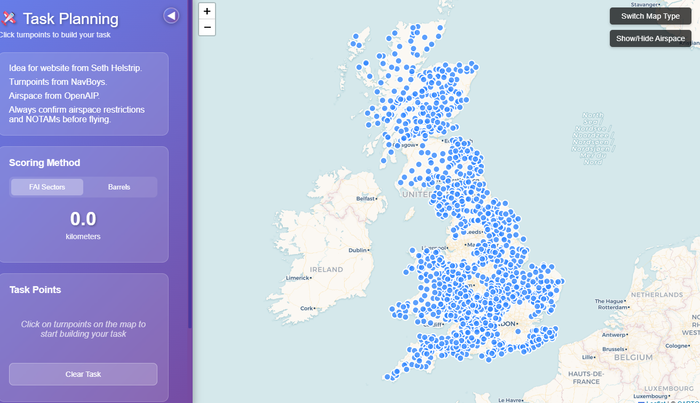
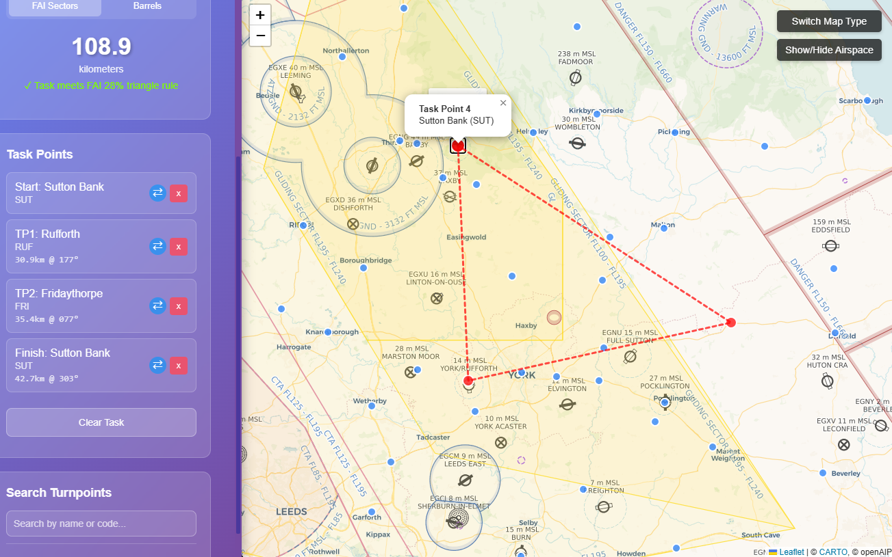

# Gliding Task Planner

## 📝 Description

The Gliding Task Planner is a web-based application designed to assist glider pilots in planning cross-country soaring tasks. Leveraging the Leaflet.js mapping library, it provides an intuitive interface for pilots to select geographical "turnpoints" and visualize their proposed flight path. The application dynamically calculates the total distance of the selected task and offers advanced features like real-time validation against the FAI 28% triangle rule and an optional airspace overlay powered by the OpenAIP API.

With over 100 active users, this tool has become a valuable resource within the gliding community, enabling more efficient and compliant task planning.




## ✨ Key Features

- **Interactive Map Interface**: Utilizes Leaflet.js to display a dynamic map with selectable turnpoints.
- **Turnpoint Selection**: Users can easily click on turnpoints on the map to add them to their planned task.
- **Dynamic Task Distance Calculation**: Automatically calculates and displays the total distance of the selected task as turnpoints are added or modified.
- **Task Management Sidebar**: A dedicated sidebar allows users to review, amend, or delete selected turnpoints from their task.
- **FAI 28% Triangle Rule Validation**: Provides instant feedback on whether the selected task meets the Fédération Aéronautique Internationale (FAI) 28% triangle rule, crucial for record flights.
- **Airspace Overlay (OpenAIP Integration)**: Option to display real-time airspace information using data from the OpenAIP API, enhancing safety and compliance during planning.
- **User-Friendly Design**: Intuitive controls and a clear interface tailored for pilots.

## 🚀 Getting Started

This is a static web application that runs directly in your web browser.

### Prerequisites

- A modern web browser (e.g., Chrome, Firefox, Edge, Safari).
- An internet connection to load map tiles and API data (OpenAIP).

### Installation (for local development/viewing)

1. Clone the repository:
```bash
git clone https://github.com/corbey08/task-planner.git
cd your-gliding-planner-repo
```

2. **Open index.html**: Simply open the index.html file in your preferred web browser.

3. Visit the live page at [corbey08.github.io/task-planner/](https://corbey08.github.io/task-planner/)

## Usage

1. Upon loading, a map will display available turnpoints.
2. Click on turnpoints to add them to your task. They will appear in the sidebar.
3. The sidebar will update with the task distance and options to manage your selected turnpoints.
4. Toggle the airspace overlay to view airspace boundaries.

## 🛠️ Technologies Used

- **HTML5**: For structuring the application.
- **CSS3 (styles.css)**: For styling and responsive layout of the map and sidebar.
- **JavaScript (script.js)**: Powers the interactive map, turnpoint logic, distance calculations, FAI rule validation, and API integrations.
- **Leaflet.js**: Open-source JavaScript library for interactive maps.
- **OpenAIP API**: Used for fetching and displaying aviation airspace data.
- **turnpoints.cup**: Geographical turnpoint data obtained from NavBoys.

## 📁 Project Structure

```
.
├── index.html                  # Main HTML file for the application
├── script.js                   # JavaScript logic for map interactions, calculations, and API calls
├── styles.css                  # Stylesheet for the application's layout and appearance
├── turnpoints.cup              # File containing turnpoint data (e.g., in CUP format)
└── LICENSE.txt                 # License file for the project
```

## 💡 What I Learned / Why I Built This

- **Geospatial Web Development**: Gained hands-on experience with Leaflet.js for building interactive map applications.
- **Complex Algorithm Implementation**: Developed and integrated the FAI 28% triangle rule calculation, involving geographical distance and geometric logic.
- **API Integration**: Successfully integrated with the OpenAIP API to fetch and render dynamic airspace data.
- **Data Parsing & Handling**: Worked with the .cup file format for turnpoint data.
- **User-Centric Design**: Focused on creating a highly usable tool that addresses a specific need within a niche community (gliding pilots).
- **Scalability & Performance**: Built an application that effectively serves 100+ active users.

## 📞 Contact

For any questions, feedback, or inquiries regarding this Gliding Task Planner, please feel free to open an issue in this repository.
